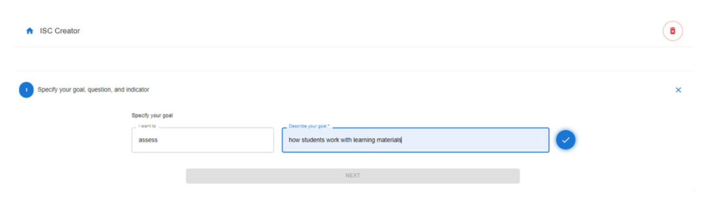
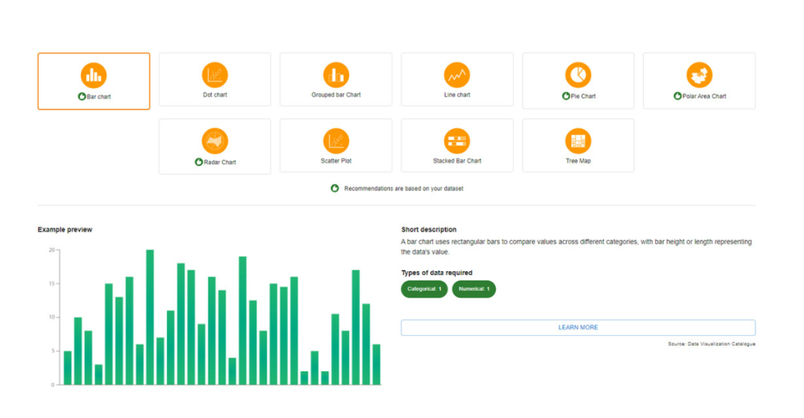
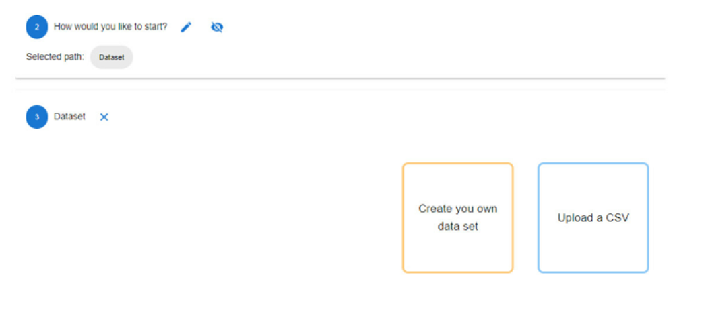
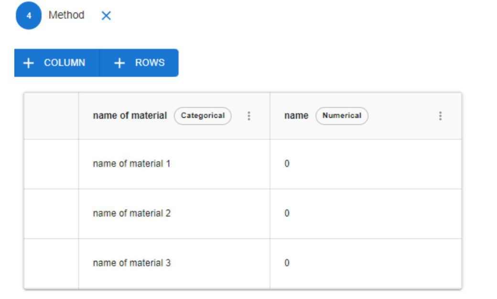

# OpenLAP ISC Creator - Redesign and Functional Improvements
This group project focused on redesigning and improving the functionality of the **OpenLAP ISC Creator**. We introduced new features, made the interface easier to use, and added better ways to work with data and visualizations.

By building on the existing ISC Creator, we created a more interactive and user-friendly experience for configuring learning analytics indicators, uploading datasets, providing helpful user feedback, and exploring data through charts.

## OpenLAP Application Web Architecture
Our solution builds on the existing OpenLAP architecture and focuses primarily on the **frontend (React.js)** layer. Enhancements were developed within the ISC Creator module.
- **To-do:** Add illustration here

### Technologies & Libraries Used
- **Frontend**: React.js
- **UI Components**: Material UI (MUI)
- **Visualization**: ApexCharts, Chart.js
- **State Management**: React Context API
- **CSV Handling**: FileReader, PapaParse
- **Version Control**: Git & GitHub

## Screenshots

This is the part, user can define the request.

When user chooses a chart, he/she can see the description of the chart.

User can choose different ways to apply his/her data.

When the user inputs data themselves, whether it is adding or deleting rows, the latest data will be synchronized to other related functions.

## Team Members
- Bianca Magistrado
- Jannik Funke genannt Kaiser
- Feifan Zhai
- Handuo Jiang
- Zakaria Bouzouf
- Alisa Ramazanova
- Sweety Kheni

## Demo Video
[OpenLAP ISC Creator Improvements by IDEA Explorer](https://www.youtube.com/watch?v=YQ7Ig9eEGd8)

## Key Features
- Real-time data type feedback in dataset table and X & Y axis selectors
- Warnings displayed when required data is missing in chart selection
- Fixed table menu icon alignment for better UI consistency
- Improved CSV file detection and resolved web app crash issues
- Synchronization of changes across different steps for smooth workflow
- Refactored dataset step for better code structure and usability

## Potential Future Improvements
- User profile integration with dataset
