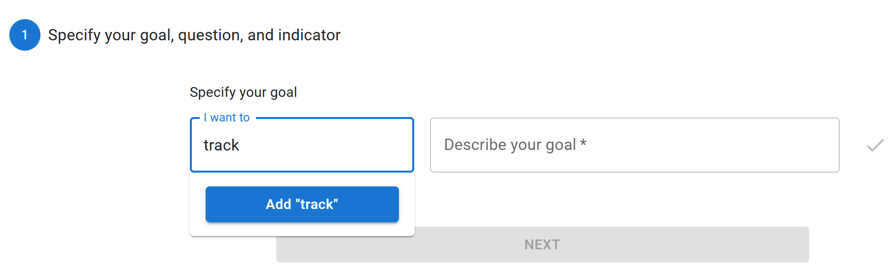
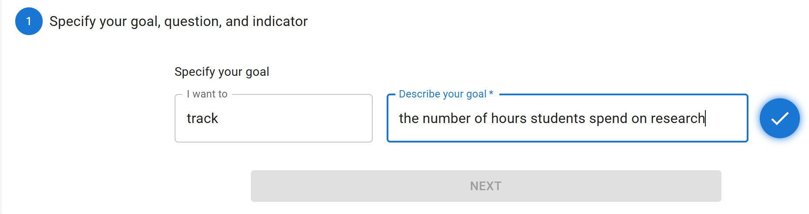
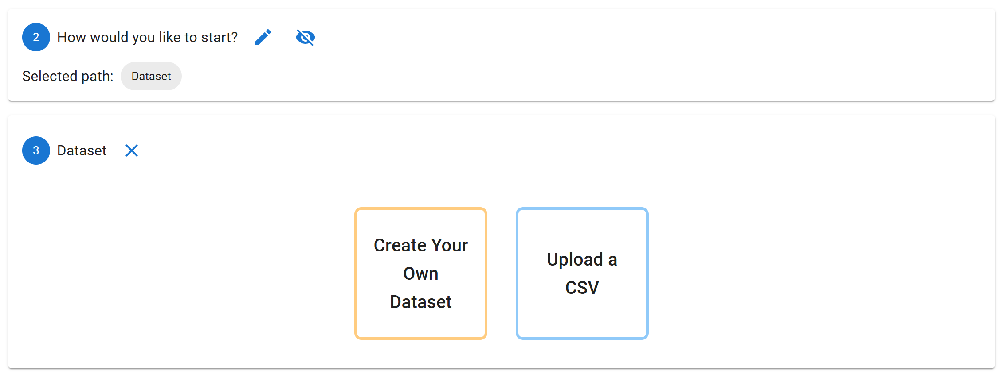
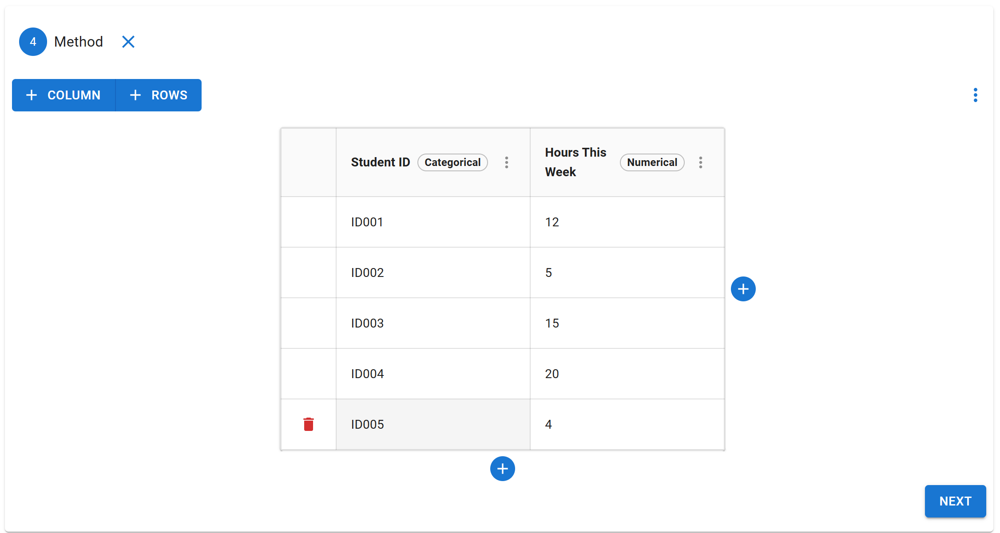
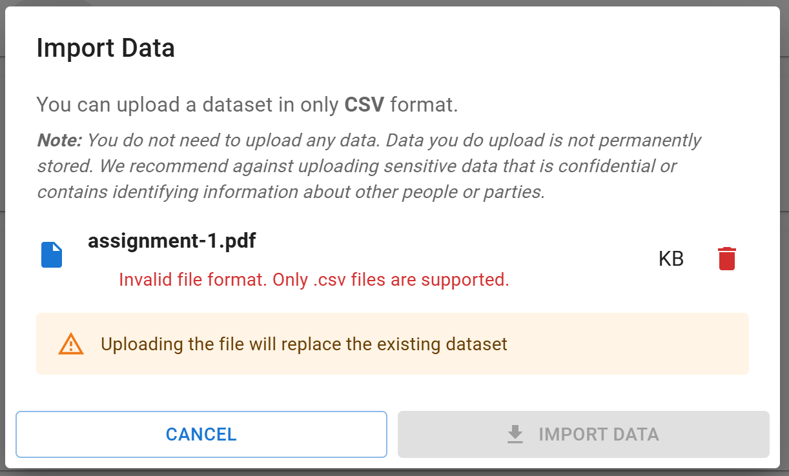
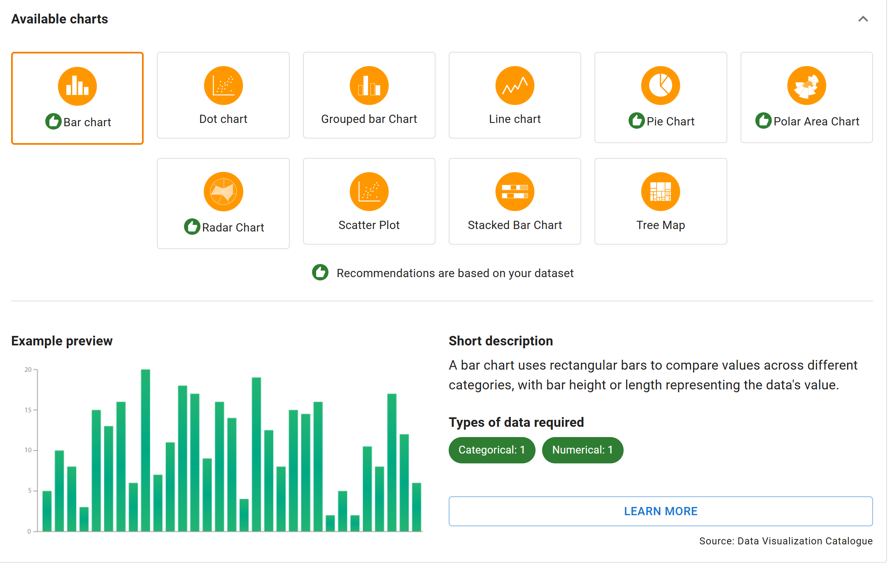
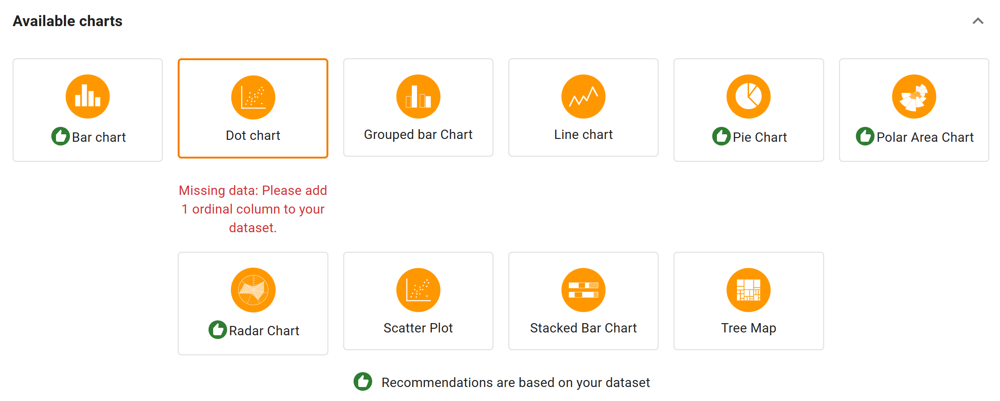
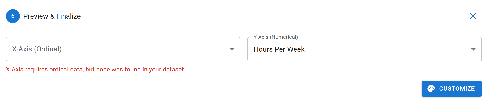

# OpenLAP ISC Creator - Redesign and Functional Improvements
This group project focused on redesigning and improving the functionality of the **OpenLAP ISC Creator**. We introduced new features, made the interface easier to use, and added better ways to work with data and visualizations.

By building on the existing ISC Creator, we created a more interactive and user-friendly experience for configuring learning analytics indicators, uploading datasets, providing helpful user feedback, and exploring data through charts.

## OpenLAP Application Web Architecture
Our solution builds on the existing OpenLAP architecture and focuses primarily on the **frontend (React.js)** layer. Enhancements were developed within the ISC Creator module.

### Technologies & Libraries Used
- **Frontend**: React.js
- **UI Components**: Material UI (MUI)
- **Visualization**: ApexCharts, Chart.js
- **State Management**: React Context API
- **CSV Handling**: FileReader, PapaParse
- **Version Control**: Git & GitHub

## Screenshots

<table>
  <tr>
    <td align="center">
       
      Setting a New Goal
    </td>
    <td align="center">
       
      Confirmation Button
    </td>
  </tr>
</table>

<table>
  <tr>
    <td align="center">
       
      Two Dataset Method
    </td>
    <td align="center">
       
      New Table
    </td>
  </tr>
</table>

<table>
  <tr>
    <td align="center">
       
      Uploading a FIle that is not CSV
    </td>
    <td align="center">
       
      Always Visible Chart Descripton
    </td>
  </tr>
</table>

<table>
  <tr>
    <td align="center">
       
      Missing Data Warning on Chart Selection
    </td>
    <td align="center">
       
      Missing Data Warning on on X/Y Axis
    </td>
  </tr>
</table>

## Team Members
> 
- Bianca Magistrado
- Jannik Funke genannt Kaiser
- Feifan Zhai
- Handuo Jiang
- Zakaria Bouzouf
- Alisa Ramazanova
- Sweety Kheni

## Demo Video
[FInal Project Demo: ISC Creator Improvements](https://www.youtube.com/watch?v=YQ7Ig9eEGd8)

## Advertisement Video
[Advertisement Video](https://mega.nz/file/KAkyWRiQ#u5hXM_gU02gIa-y7nvpeARn7uYPx1sfQDspGpT6wtVk)

## Key Features
- Synchronization of changes across different steps for smooth workflow
- Refactored dataset step for better code structure and usability
- Improved CSV file detection and resolved web app crash issues
- Real-time data type feedback in dataset table and X & Y axis selectors
- Warnings displayed when required data is missing in chart selection

## Potential Future Improvements
- User profile integration with dataset
